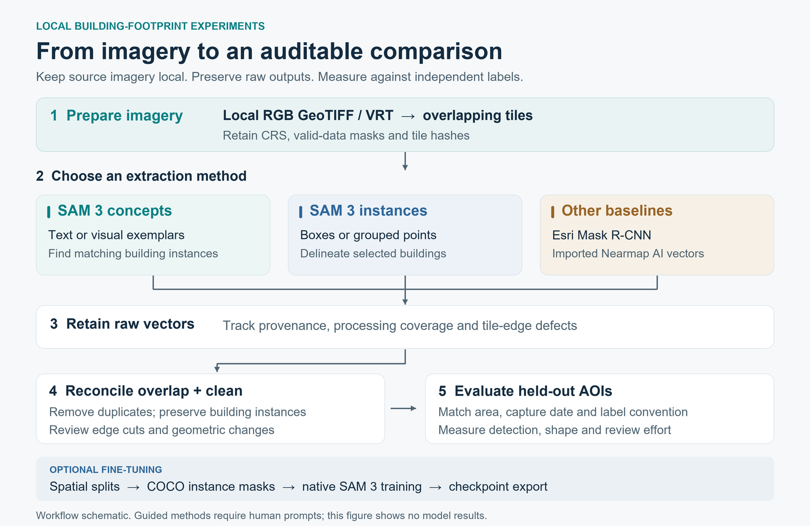
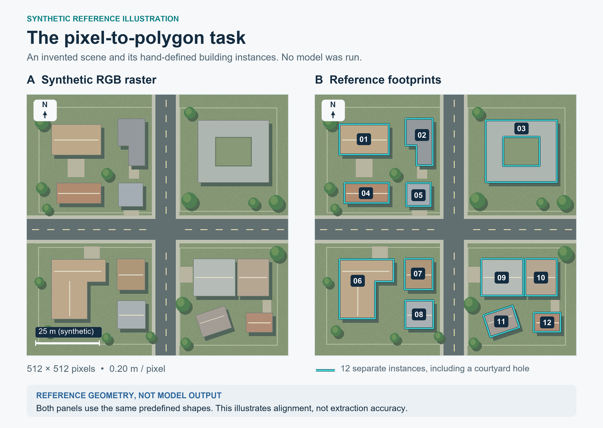

# Building footprints from aerial imagery

[](https://github.com/efkopru/nearmap-building-footprints/actions/workflows/cpu-tests.yml)


**A reproducible GIS workflow for comparing SAM 3 building extraction methods on locally supplied Nearmap or other georeferenced aerial imagery.**

Prepare overlapping image tiles, run text or guided segmentation, reconcile duplicate polygons, and evaluate methods against the same independently labeled area. Raw instances, processing receipts, input hashes, and evaluation layers keep each result traceable.



**Status:** CPU workflow tests and synthetic integration checks are implemented. Real Nearmap imagery, SAM 3 GPU inference, fine-tuning, and ArcPy execution have not been run for this project. The figures below are synthetic illustrations, not model results.

[Setup and usage](docs/USAGE.md) · [Methodology](docs/METHODOLOGY.md) · [Prompt formats](docs/PROMPTS.md) · [Validation record](docs/VALIDATION.md)

## What is included

| Method | Input or setup | Purpose |
| --- | --- | --- |
| SAM 3 text | A concept such as `building` | Discover building instances in each tile. |
| SAM 3 visual exemplars | Positive and negative example boxes | Find objects matching examples within the current tile. |
| SAM 3 individual boxes | One bounding box per building | Delineate buildings already identified by a person or detector. |
| SAM 3 grouped points | Foreground/background points grouped by object | Delineate and refine individual buildings. |
| SAM 3 fine-tuning | Spatially separated imagery and instance labels | Prepare COCO masks, launch training, and export weights for text/exemplar inference. |
| Esri baseline | A downloaded model and licensed ArcGIS environment | Run the Building Footprint Extraction USA model locally. |
| Existing vector baseline | A local Nearmap AI or other building export | Apply the same cleanup and evaluation to an existing result. |

The common pipeline preserves CRS, raster transforms, valid-data masks, separate building instances, and courtyard holes. Cleanup includes duplicate suppression and optional conservative regularization. Evaluation produces one-to-one matches, precision/recall/F1, overlap, area error, boundary distances, and GIS layers for inspection.

## Synthetic example



*Generated illustration with known building outlines. It contains no Nearmap imagery and shows no neural-network predictions. See [figure provenance](docs/images/README.md) for reproduction.*

## Quick start

### 1. Install the CPU workflow

Python **3.12** is required for the tested setup. In Windows PowerShell:

```powershell
git clone https://github.com/efkopru/nearmap-building-footprints.git
Set-Location nearmap-building-footprints
.\scripts\setup_cpu.ps1
.\.venv\Scripts\Activate.ps1
nbf doctor
```

The setup script creates a virtual environment, installs the locked CPU dependencies, and runs the tests. [Manual installation and Linux commands](docs/USAGE.md) are provided separately. GPU dependencies and model weights are separate from this installation.

### 2. Run a synthetic smoke test

```powershell
nbf demo --output data/demo
nbf inspect data/demo/imagery.tif
nbf tile data/demo/imagery.tif --output data/demo_tiles --tile-size 256 --overlap 64
nbf infer --manifest data/demo_tiles/manifest.json --method text --output outputs/demo_plan
```

The final command creates an inference **plan**. Model inference requires `--execute`. Use a new output path for each run. The [full smoke test](docs/USAGE.md#2-cpu-smoke-test-no-model-or-real-imagery) also exercises cleanup, evaluation, and training-data preparation.

### 3. Prepare a real imagery pilot

Supply a local, north-up, georeferenced **8-bit RGB GeoTIFF or VRT**. Start with a small area containing representative buildings and independently prepared reference labels.

```powershell
nbf inspect 'D:\Nearmap\pilot_rgb.tif'
nbf tile 'D:\Nearmap\pilot_rgb.tif' --output data/prepared/pilot01 --tile-size 1024 --overlap 128
```

Configure a separate **Linux/WSL2 NVIDIA CUDA environment** with `scripts/setup_sam3.sh`, obtain SAM 3 model access and a checkpoint, then run a limited pilot:

```bash
nbf infer --manifest data/prepared/pilot01/manifest.json --method text \
  --text building --checkpoint models/sam3.pt \
  --output outputs/text_pilot01 --limit 5 --execute
```

[The usage guide](docs/USAGE.md#4-sam-3-gpu-environment) covers GPU setup, guided prompts, checkpoint provenance, resume behavior, cleanup, and evaluation. The supplied fine-tuning recipe trains the concept branch for text/exemplar inference; it does not train the separate interactive box/point branch.

## Evaluate before scaling

- Define whether the target is a **roof outline or ground footprint**. Roof overhang and displacement can make those different geometries.
- Separate training, validation, and test areas spatially. Tune prompts and cleanup on validation data, then freeze the settings for the test area.
- Compare methods on the same completely labeled area. Record manual prompting effort alongside geometric accuracy.
- Inspect tile-edge detections, missed buildings, merged roofs, and false positives in the exported evaluation layers.
- Use `nbf compare` to combine evaluation reports. It checks reference/AOI geometry fingerprints and evaluation settings before writing a CSV.

Synthetic identity fixtures test data handling and metric calculations. Their perfect overlap is expected by construction and **is not extraction accuracy**. Model confidence is also not measured accuracy. The [methodology](docs/METHODOLOGY.md) defines the experiment and reporting protocol.

## Repository guide

| Path | Contents |
| --- | --- |
| `src/nearmap_buildings/` | CLI, tiling, inference adapters, cleanup, evaluation, training, and baseline imports. |
| `scripts/` | CPU/GPU setup, experiment runner, and README figure generation. |
| `configs/` | Example experiments and a pinned upstream training recipe. |
| `tests/` | CPU geometry, data, adapter, and checkpoint-format tests. |
| [docs/USAGE.md](docs/USAGE.md) | Installation and commands from input imagery to comparison. |
| [docs/OPTIONAL_METHODS.md](docs/OPTIONAL_METHODS.md) | Fine-tuning, checkpoint export, Esri, and imported vectors. |
| [docs/SOURCES.md](docs/SOURCES.md) | Primary references and audited upstream revisions. |
| [docs/VALIDATION.md](docs/VALIDATION.md) | What was verified and what still needs real-environment execution. |

Local imagery, labels, checkpoints, environments, and working outputs are excluded from version control. No imagery download service or paid API calls are implemented. This is an independent project; Nearmap, Meta/SAM 3, SamGeo, and Esri retain their respective software, model, and data terms.
