# Lewisville, Texas: results so far

This page compares SAM 3 and Esri's building model on Nearmap's May 2026 imagery of Lewisville (10.16 cm), across the whole city and on an Old Town sample. **Every score here measures agreement with the city's building outlines collected in 2015 or earlier, not accuracy.** Accuracy comes once two sample areas are reviewed against the 2026 imagery. Screenshots of the results stay in a private report because the imagery is licensed; this page has aggregate numbers and imagery-free charts only.

## Key findings

- **Esri leads on main buildings.** City-wide F1 on buildings of 20 m² and up: the city's Esri run 0.83, SAM 3 0.74. Recall is close (0.85 against 0.82); SAM 3 draws more outlines that the 2015 layer lacks (precision 0.68 against 0.82).
- **The two models mostly agree.** 91% of Esri's outlines have a matching SAM 3 outline, and both find 94% and 90% of the 2015 outlines of 100 m² and up. Matched to the 2015 outlines, SAM 3's outlines fit slightly more tightly (median IoU 0.80 against 0.77).
- **SAM 3 finds more small structures, but sheds are still missed.** Of the 7,867 2015 outlines under 20 m², SAM 3 matched 267 and Esri 2; 7,599 were found by neither.
- **Many extra outlines are likely new buildings.** 4,923 of SAM 3's outlines with no 2015 match also match an Esri outline, such as whole subdivisions built since 2015.
- **Large buildings break up.** Buildings longer than a processing tile come out in pieces: SAM 3 finds only parts or splits them where tiles meet, and Esri's outlines are cut at its chip edges.
- **Esri's post-processing helps.** The same Esri model run locally without it, at a 0.9 cut-off, scores F1 0.77 on main buildings against the city run's 0.83. It finds more small structures (352 under 20 m²) but draws many more extra outlines.
- **SAM 3's settings matter.** On main buildings in Old Town, 1536 px tiles, the prompt "building" and a 0.7 cut-off raised its F1 to 0.53, from 0.46 with the best 1024 px setting. Those settings were used for the city-wide run.

## City-wide: SAM 3 and Esri against the 2015 outlines

The city ran Esri's Building Footprint Extraction – USA model on the same May 2026 capture. SAM 3 ran on all 6,538 tiles of 1536 px covering the city, with the best settings from the preliminary Old Town runs: the prompt "building" and a 0.7 confidence cut-off. The same Esri model also ran locally over the whole city, in 150 chunks. All three went through the same cleanup and are scored against the 38,882 older outlines inside the city limits. The numbers are also in [citywide_scores.csv](citywide_scores.csv) and [citywide_by_size.csv](citywide_by_size.csv).

| Method | Outlines | Matched | Extra | Missed | Precision | Recall | F1 | F1, 20 m² and up | Median IoU |
|---|---|---|---|---|---|---|---|---|---|
| Esri, city run | 32,608 | 26,502 | 6,106 | 12,380 | 0.81 | 0.68 | 0.74 | 0.83 | 0.77 |
| SAM 3 | 37,906 | 25,758 | 12,148 | 13,124 | 0.68 | 0.66 | 0.67 | 0.74 | 0.80 |
| Esri, local raw run | 38,860 | 26,536 | 12,324 | 12,346 | 0.68 | 0.68 | 0.68 | 0.77 | 0.80 |

Extra outlines are not all errors: many are buildings built since 2015. The local raw run is the same Esri model through `DetectObjectsUsingDeepLearning`, without Esri's post-processing, kept at a 0.9 cut-off; the charts below compare the city's Esri run with SAM 3.

| Building size | 2015 outlines | Found by Esri, city run | Found by SAM 3 | Found by both | Only Esri | Only SAM 3 | Missed by both |
|---|---|---|---|---|---|---|---|
| under 20 m² | 7,867 | 2 (0.0%) | 267 (3.4%) | 1 | 1 | 266 | 7,599 |
| 20–50 m² | 2,346 | 194 (8.3%) | 577 (24.6%) | 107 | 87 | 470 | 1,682 |
| 50–100 m² | 1,710 | 896 (52.4%) | 669 (39.1%) | 530 | 366 | 139 | 675 |
| 100 m² and up | 26,959 | 25,410 (94.3%) | 24,245 (89.9%) | 23,947 | 1,463 | 298 | 1,251 |

Of the 38,882 2015 outlines, both models found 24,585, Esri alone 1,917, SAM 3 alone 1,173 and neither 11,207. Most of those missed by both are sheds under 20 m²; some others have been demolished since 2015. Adding the local Esri run, 10,463 outlines are missed by all three, 7,359 of them under 20 m².

**SAM 3 against Esri, without the 2015 outlines.** Matched to each other at IoU ≥ 0.5: 29,567 pairs, with a median IoU of 0.81. 91% of Esri's outlines have a SAM 3 match and 78% of SAM 3's have an Esri match. Of SAM 3's 12,148 outlines with no 2015 match, 4,923 match an Esri outline. Where two independent models agree and no 2015 outline matches, the building is most likely new or changed since 2015.

**What the screenshots show.** The private report has eight screenshots: two typical areas and six picked by rule, each the 300 m square with the most of one kind of difference. In a new subdivision with no 2015 outlines, both models outline every house. At an apartment complex, Esri outlines long carport and garage rows that SAM 3 mostly misses. On older streets, SAM 3 outlines more back-yard garages and sheds. Long industrial roofs are split where SAM 3's tiles meet. Some 2015 outlines sit in empty fields, where buildings have since been demolished.

## Old Town sample: the untuned baseline

A 700 m square around Old Town with 319 of the 2015 outlines, every method at its default settings. Details are in [lewisville_old_town](../lewisville_old_town/README.md).

| Method | Matched | Extra | Missed | Precision | Recall | F1 | Median IoU |
|---|---|---|---|---|---|---|---|
| SAM 3 | 142 | 287 | 177 | 0.33 | 0.45 | 0.38 | 0.74 |
| Esri, city run | 135 | 63 | 184 | 0.68 | 0.42 | 0.52 | 0.75 |
| Esri, local raw | 158 | 381 | 161 | 0.29 | 0.50 | 0.37 | 0.74 |

| Method | Recall ≥ 50 m² | Precision ≥ 50 m² | Recall < 50 m² |
|---|---|---|---|
| SAM 3 | 0.63 | 0.39 | 0.10 |
| Esri, city run | 0.64 | 0.69 | 0.01 |
| Esri, local raw | 0.71 | 0.36 | 0.10 |

## First tuning runs (preliminary)

The objective, fixed in advance in the [tuning protocol](tuning_protocol.md), is F1 at IoU ≥ 0.5 on main buildings of 20 m² and up in the Old Town square. These scores use the 2015 outlines. Settings are chosen once Old Town's outlines have been reviewed, then scored once on a separate test area. Every combination is in [tuning_preliminary.csv](tuning_preliminary.csv).

Best F1 for each setting. These scores count only buildings of 20 m² and up, so they run higher than the baseline table above. Shed recall is the share of 2015 outlines under 20 m² that were found.

| Method | Setting | Precision | Recall | F1 | Shed recall |
|---|---|---|---|---|---|
| Esri, city run | as published | 0.69 | 0.55 | 0.61 | 0.00 |
| Esri, local raw | ≥ 0.9 | 0.56 | 0.50 | 0.53 | 0.03 |
| SAM 3 | "building", 1536 px, ≥ 0.7 | 0.53 | 0.52 | 0.53 | 0.03 |
| SAM 3 | "building", 2048 px, ≥ 0.7 | 0.55 | 0.50 | 0.53 | 0.01 |
| SAM 3 | "house", 1536 px, ≥ 0.7 | 0.60 | 0.42 | 0.50 | 0.03 |
| SAM 3 | "house", 2048 px, ≥ 0.5 | 0.49 | 0.48 | 0.48 | 0.04 |
| SAM 3 | "roof", 2048 px, ≥ 0.7 | 0.48 | 0.47 | 0.47 | 0.01 |
| SAM 3 | "building", 1024 px, ≥ 0.7 | 0.44 | 0.49 | 0.46 | 0.04 |
| SAM 3 | "roof", 1536 px, ≥ 0.7 | 0.41 | 0.50 | 0.45 | 0.03 |
| SAM 3 | "house", 1024 px, ≥ 0.4 | 0.38 | 0.51 | 0.44 | 0.14 |
| SAM 3 | "roof", 1024 px, ≥ 0.7 | 0.30 | 0.47 | 0.36 | 0.08 |

SAM 3 F1 by prompt, tile size and confidence cut-off:

| Prompt | Tile size | ≥ 0.3 | ≥ 0.4 | ≥ 0.5 | ≥ 0.6 | ≥ 0.7 |
|---|---|---|---|---|---|---|
| "building" | 1024 px | 0.38 | 0.41 | 0.43 | 0.44 | 0.46 |
| "building" | 1536 px | 0.43 | 0.46 | 0.46 | 0.49 | 0.53 |
| "building" | 2048 px | 0.43 | 0.46 | 0.47 | 0.51 | 0.53 |
| "house" | 1024 px | 0.43 | 0.44 | 0.43 | 0.43 | 0.42 |
| "house" | 1536 px | 0.44 | 0.47 | 0.46 | 0.47 | 0.50 |
| "house" | 2048 px | 0.44 | 0.47 | 0.48 | 0.48 | 0.45 |
| "roof" | 1024 px | 0.29 | 0.31 | 0.34 | 0.35 | 0.36 |
| "roof" | 1536 px | 0.34 | 0.37 | 0.39 | 0.41 | 0.45 |
| "roof" | 2048 px | 0.36 | 0.40 | 0.42 | 0.44 | 0.47 |

Bigger tiles and higher cut-offs help. The best cut-off, 0.7, is the top of the range fixed in advance, so testing higher cut-offs is proposed as a protocol change before the reviewed outlines are used. The local Esri run's cut-off sweep: ≥ 0.5: 0.43 · ≥ 0.6: 0.46 · ≥ 0.7: 0.49 · ≥ 0.8: 0.51 · ≥ 0.9: 0.53.

## Runtime on a laptop RTX 4050 (6 GB)

| Run | Area or tiles | Time | City-wide |
|---|---|---|---|
| SAM 3, 1024 px tiles | 90 tiles (Old Town) | 105 s (0.82 s per tile) | about 3.3 h, estimated |
| SAM 3, 1536 px tiles | 6,538 tiles (whole city) | 2 h 41 min (median 1.08 s of model time per tile) | measured |
| Esri, local raw run | 0.64 km² (Old Town) | 4.9 min | about 15 h, estimated |
| Esri, local raw run | 150 chunks of about 1.1 km (whole city) | 8 h 46 min of model time | measured |

SAM 3 used up to 96% of the GPU's memory, close to the limit but stable through the city-wide run.

## How this was run

- **Imagery:** a Nearmap mosaic from May 2026, 10.16 cm, clipped to the city limits. Its GeoTIFF declared a local CRS in metres; it is EPSG:2276 in US survey feet, corrected through a VRT and checked against the city limits.
- **Reference:** the City of Lewisville's public building outlines, collected in 2015 or earlier. They align with the imagery to within about 0.4 m.
- **Methods:**
  - **SAM 3:** a text prompt through SamGeo 1.4.2, at a pinned commit. The city-wide run used 1536 px tiles overlapping by 192 px, the prompt "building" and a 0.7 cut-off.
  - **Esri, city run:** Building Footprint Extraction – USA through `ExtractFeaturesUsingAIModels` with default settings, published by the city.
  - **Esri, local raw run:** the same model through `DetectObjectsUsingDeepLearning` without NMS. City-wide it runs in 150 overlapping chunks of about 1.1 km; each chunk keeps only the outlines centred in its own core.
- **Scoring,** identical for every method: EPSG:26914, 4 m² minimum, duplicate suppression, one-to-one matching at IoU ≥ 0.5, and buildings crossing an area's edge excluded.
- **Screenshot areas** were picked by a fixed rule and kept at least 500 m from both review areas, so the reviews stay independent of the models.

## Next

1. Review Old Town's outlines against the 2026 imagery, then choose each model's settings by the fixed rule. A new cut-off needs only cleanup; a new prompt or tile size means rerunning SAM 3 on the city, under 3 hours.
2. Review the test area, a 700 m square chosen by a seeded random rule, and score the frozen settings there once. That is the accuracy result.
3. Decide on fine-tuning if sheds matter: neither model finds most of them.
